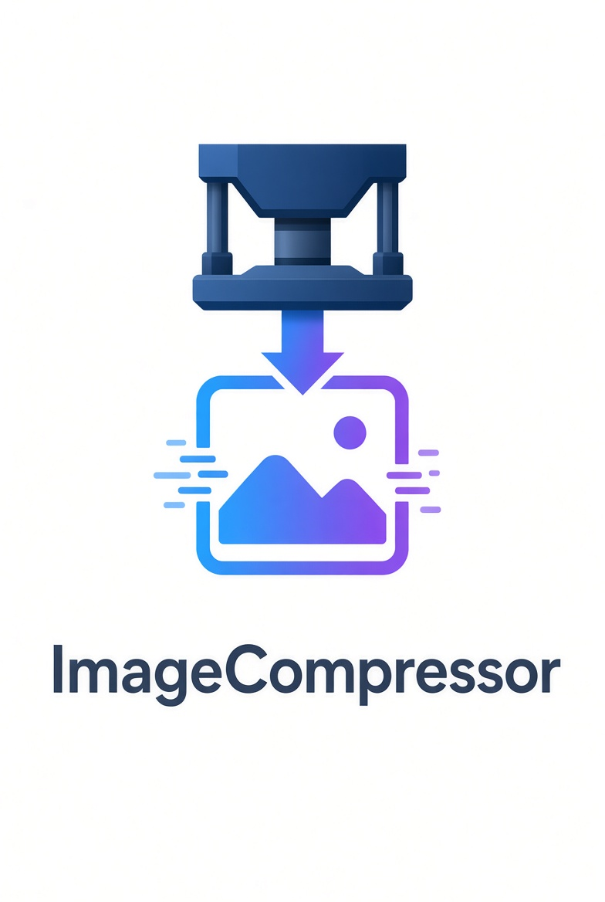

# 🖼️ **Image Optimization Tool**
**Công cụ Nén & Tối Ưu Ảnh Offline Chuyên Nghiệp**
---
https://kcydvn-a11y.github.io/ImageCompressor/

> Nén ảnh giữ nguyên định dạng, chất lượng cao, hỗ trợ đầy đủ JPEG • PNG • GIF • WebP • BMP • TIFF • HEIC.  
> Hoạt động hoàn toàn offline, không cần tải lên server.
**Tác giả:** Thái Thông  

---

## ✨ TÍNH NĂNG NỔI BẬT

- **Nén ảnh offline chuyên nghiệp**  
  Hỗ trợ đầy đủ các định dạng phổ biến: JPEG, PNG, GIF, WebP, BMP, TIFF, HEIC.

- **So sánh trực quan**  
  Thanh kéo (slider) so sánh ảnh gốc và ảnh đã nén ngay trên giao diện.

- **Điều chỉnh chất lượng linh hoạt**  
  Thanh trượt chất lượng từ 1% – 100%, kết hợp thuật toán tối ưu theo entropy.

- **Thay đổi kích thước thông minh**  
  Hỗ trợ nhập kích thước theo **pixel** hoặc **inch**, kết hợp chọn PPI (300 / 326 / 600 / 1200).

- **Xoay & Lật ảnh**  
  Xoay 90° / 180° / 270° hoặc góc tùy chỉnh, lật ngang / lật dọc.

- **Cắt ảnh (Crop)**  
  Khung cắt trực quan kèm thước đo pixel thực tế, hỗ trợ kéo góc và di chuyển.

- **Xử lý hàng loạt**  
  Nén tất cả ảnh cùng lúc + lưu toàn bộ ảnh đã nén chỉ với một cú click.

- **Đa ngôn ngữ**  
  Hỗ trợ **Tiếng Việt / English / Français**.

- **Hiệu suất cao**  
  Sử dụng **Worker Pool** xử lý song song, tận dụng tối đa CPU, không làm đơ trình duyệt.

---

## 🧠 CÔNG NGHỆ BÊN TRONG

- **Web Worker Pool** – Xử lý song song nhiều ảnh cùng lúc
- **Progressive Compression** – Thuật toán nén tiến tiến dựa trên entropy
- **OffscreenCanvas** – Vẽ và xử lý ảnh hiệu suất cao
- **Hỗ trợ HEIC / TIFF** – Sử dụng heic2any + UTIF
- **DPI Injection** – Ghi đúng thông số PPI vào file JPEG
- **Hoàn toàn Offline** – Không gửi dữ liệu lên server

---

## 📥 CÁCH SỬ DỤNG

1. Mở file `ImageCompressor.html` bằng trình duyệt (Chrome / Edge / Firefox khuyến nghị)
2. Kéo thả ảnh vào vùng upload hoặc click để chọn nhiều ảnh
3. Điều chỉnh **Chất lượng**, **Kích thước**, **PPI** nếu cần
4. Nhấn **Nén Tất Cả**
5. Dùng thanh kéo để so sánh kết quả
6. Nhấn **Lưu Tất Cả Ảnh** để tải về

---

## 🛠️ TÍNH NĂNG CHỈNH SỬA NÂNG CAO

| Tính năng          | Mô tả                                      |
|--------------------|--------------------------------------------|
| **Xoay ảnh**       | 90° / 180° / 270° + góc tùy chỉnh + lật   |
| **Cắt ảnh**        | Khung cắt tự do + thước đo pixel          |
| **Resize**         | Theo pixel hoặc inch + chọn PPI            |
| **Reset**          | Khôi phục ảnh gốc bất cứ lúc nào           |
| **Batch Save**     | Lưu tất cả ảnh đã nén cùng lúc             |

---

## 📋 LƯU Ý

- Công cụ hoạt động tốt nhất trên **Chrome / Edge / Brave**
- Ảnh HEIC sẽ được chuyển sang định dạng tương thích khi cần
- Tất cả xử lý đều diễn ra **hoàn toàn trên máy của bạn** (offline)

---

## 📬 LIÊN HỆ & HỖ TRỢ

- **Tác giả:** Thái Thông  
- **Email:** [ThaiThongsj@gmail.com](mailto:ThaiThongsj@gmail.com)

**Ủng hộ dự án:**  

`9898661918` • **Vietcombank** (NGUYỄN NGỌC THÁI THÔNG)

---

**Cảm ơn bạn đã sử dụng Image Optimization Tool!**  
Nén ảnh nhanh – nhẹ – chất lượng cao. ✨
